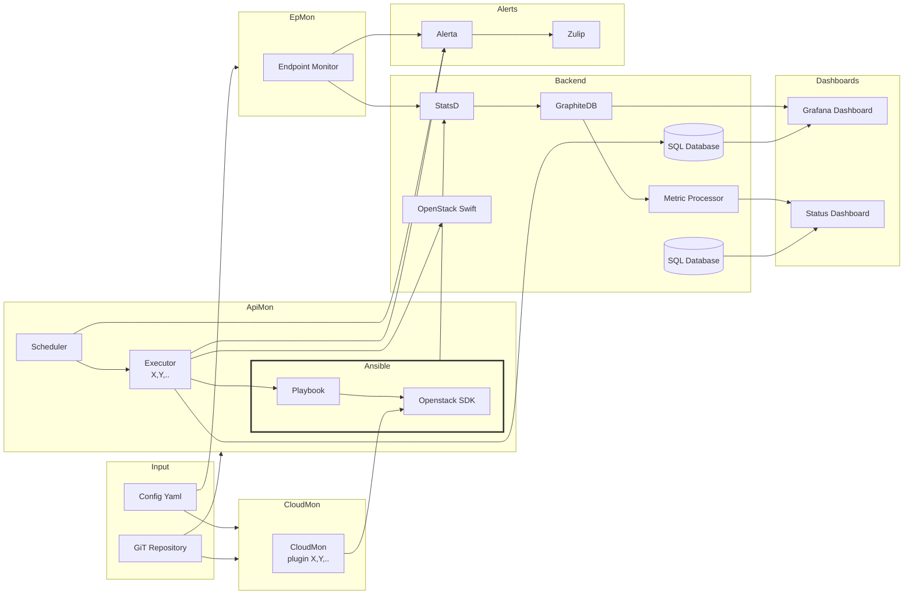

# StackMon (CloudMon)

StackMon or CloudMon is a stack of tools to monitor complex environments (like
a cloud) by operators from a user perspective. It evolved from initially a
small bash script invoking openstackclient to test OpenStack public cloud as a
user.

The best name for the project would be CloudMon, since it is designed to be
testing clouds, but the name was already used and so the StackMon was born. It
should be treated as a synonym for CloudMon across the documentation and code.

## Overview

CloudMon is not a testing platform, but a monitoring. But what is the best way
to monitor whether user is in example able to provision a server in a cloud and
how much time it takes? With this question in mind CloudMon approaches cloud
with test scenarios that simulate regular user activity.

Another explicit design decision of CloudMon was to define those test scenarios
in a way, that anybody (really anybody) is able to perform it locally of from
anywhere else in the world without deep knowledge of testing frameworks or
programming languages. As such an idea of using Ansible playbooks has been
chosen. It is very easy to read playbooks and understand what it does. They can
be also used by platform users as a reference on platform capabilities showing
what platform operator is also verifying.

## Components

StackMon is not trying to reimplement the wheel, but instead combines existing
and time proven tools using sometimes non standard ways of doing usual things.

- [Cloudmon](/docs/cloudmon) - whole stack is very complex to oversee, so a single
  CLI for dealing with various components is being developed

- [ApiMon](/docs/apimon) - Scheduler and executor for tests

- [EpMon](/docs/epmon) - Endpoint monitoring (dummy GET requests to specific endpoints
  expecting to get back something like a 200 status code)

- [Status Dashboard](/docs/status-dashboard) - no service provider is able to avoid
  necessity of having status dashboard. A tiny open status dashboard is created
  with customizability in mind.

## Principles

Everything opensource.
